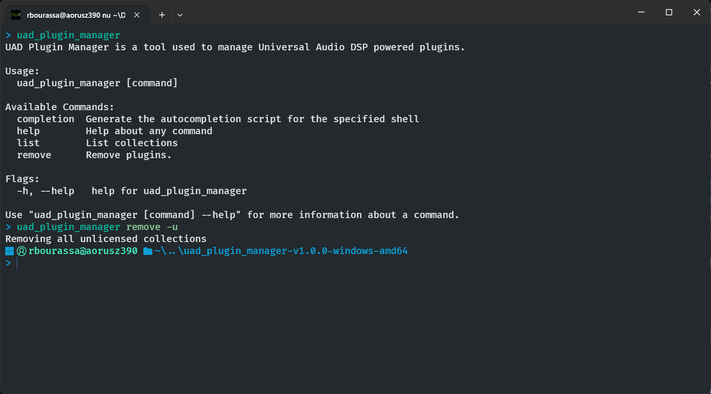
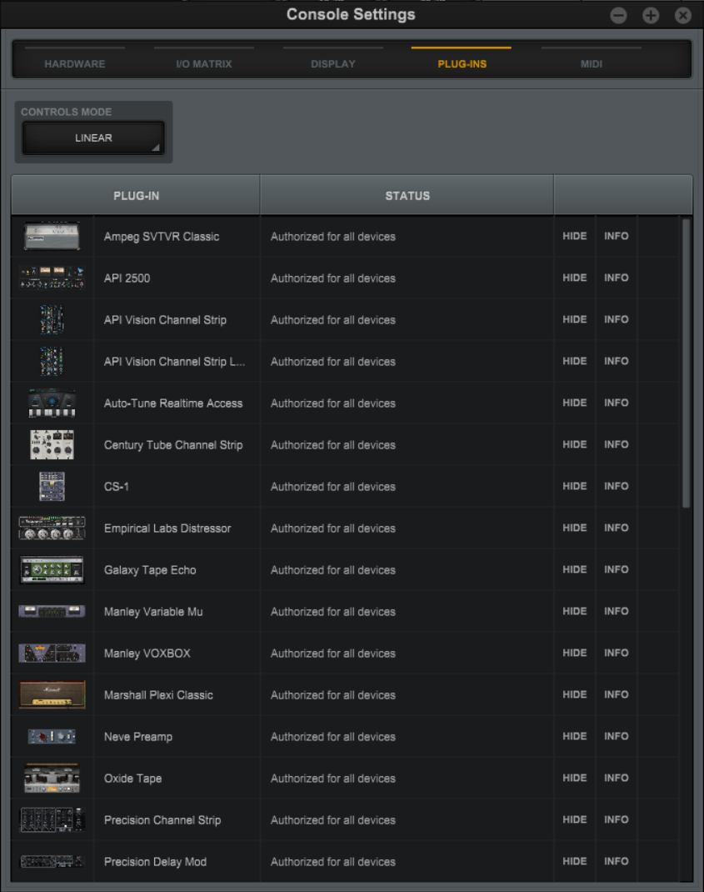
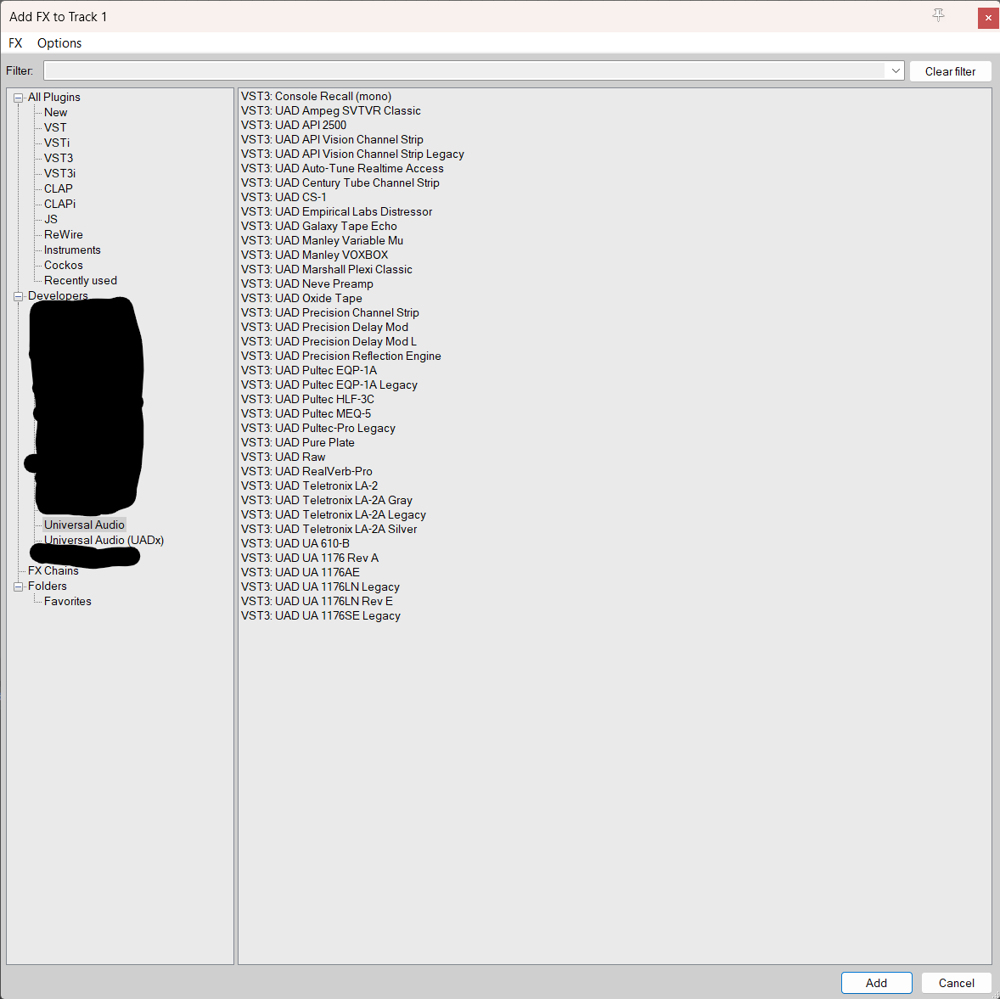

# UAD Plugin Manager

UAD Plugin Manager is a simple tool used to manage Universal Audio DSP powered plugins.

## Why?

When you install or upgrade the drivers for your Universal Audio interface, the installer reinstalls every plugins. Even if you don't own them. This makes browsing plugins harder since you need to remember exactly which one you own.

You can hide or remove the plugins by hand, but, with every update it becomes a time consuming process. This tool was created to simplify this process.

## How to use

1. Download the latest release & extract the content in a folder.
2. Place your `UADSystemProfile.txt` in the same folder as the executable [^1]
3. Open the terminal in the folder containing the executable.
4. Run de project using `uad_plugin_manager`, you'll see available commands in the terminal.

### Commands

- Remove all unlicensed plugins `remove -u` [^2]
- Remove specific collections of plugins `remove -n "UAD Ampeg B15N Bass Amplifier" -n "UAD SPL Vitalizer MK2-T"` [^2]
- Display all available collections and the plugins they contain `list -a`

### Examples

- `uadPluginManager remove -u` [^2]
- `uadPluginManager remove -n "UAD Ampeg B15N Bass Amplifier" -n "UAD SPL Vitalizer MK2-T"` [^2]
- `uadPluginManager list -a`

### Configuration

UAD Plugin Manager checks for configuration files in two directories in this specific order:
1. The same directory as the executable.
2. The operating system configuration data folder
    1. `$HOME/Library/Application Support/UAD-Plugin-Manager` on Mac OS X
    2. `%AppData%/UAD-Plugin-Manager` on Windows

If configuration files aren't found, the latest ones will be downloaded from this repository and be placed in the operating system configuration data folder.

Configuration files in the same directory as the executable file will always have priority.

### Screenshots

### FAQ

- Executable is detected as a virus, why is that?
  - This is a problem related to the structure of the compiled go binaries, you can get more information [here](https://go.dev/doc/faq#virus).
- Can providing my UADSystemProfile.txt be dangerous?
  - UADSystemProfile.txt contains a bunch of information related to your UAD hardware. Do not share it with anyone you do not trust. That being said, if you want to be cautious while using this tool, you can open it and delete everything before the line containing `UAD-2 Plug-in Authorizations`.
- I purchased a plugin after I removed my unlicensed plugins, how can I install it?
  - As of right now, you'll need to reinstall the UAD software and re-run this tool to remove the unlicensed plugins. I plan on adding a function to re-add only purchased plugins in the future, but I'm pretty busy with work, so I have no idea when I'll do it.

[^1]: To get your UADSystemProfile.txt be sure your audio interface is open and connected, open `UAD Meter & Control Panel`, click on the hamburger menu and click `System Info...`. In the new window, be sure to be in the System Info tab and click `Save Detailed System Profile` at the bottom of the page.
[^2]: Some commands may need to run with elevated privileges since they handle protected files. On Windows you'll need to run the terminal as an administrator before using the commands and on Mac OS X you'll need to prepend sudo to the commands.
